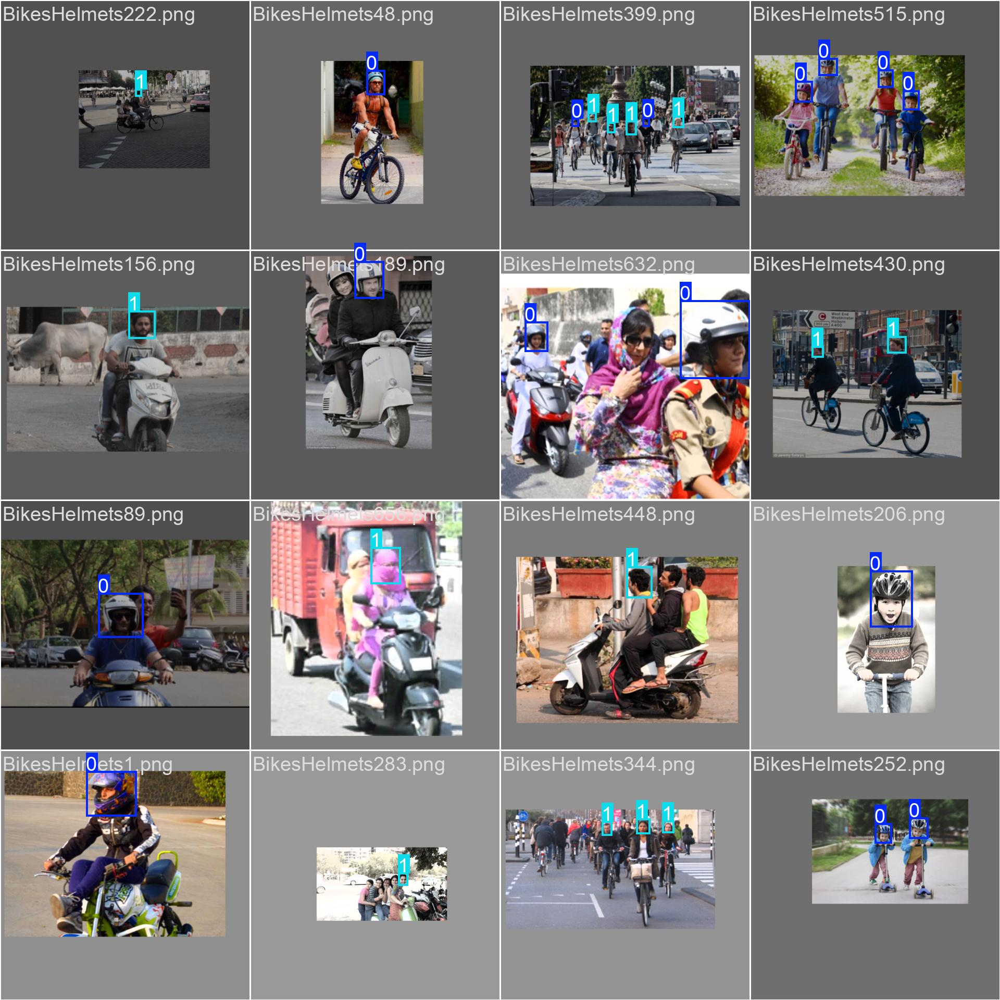

# 🏍️ Detección de uso de casco en motociclistas con YOLOv8

Este proyecto implementa un sistema de **detección automática del uso de cascos en motociclistas** utilizando tres variantes del modelo **YOLOv8** (`nano`, `small` y `medium`).  
El objetivo es comparar el rendimiento de cada modelo y evaluar su aplicabilidad en sistemas de **seguridad vial inteligente**.

---

## 📊 Descripción del proyecto
- **Tarea:** Detección de objetos (casco vs. no casco).  
- **Dataset:** [Helmet Detection Dataset - Kaggle](https://www.kaggle.com/datasets/andrewmvd/helmet-detection)  
- **Formatos:** Original VOC, convertido a formato YOLO.  
- **División:** 
  - 70% entrenamiento (534 imágenes)  
  - 20% validación (153 imágenes)  
  - 10% prueba (78 imágenes)  

---

## ⚙️ Modelos utilizados
Se entrenaron tres variantes de YOLOv8 en **Google Colab** con GPU NVIDIA T4:

- **YOLOv8n (Nano):** ligero y rápido, ideal para dispositivos móviles.  
- **YOLOv8s (Small):** balance entre velocidad y precisión.  
- **YOLOv8m (Medium):** mayor precisión, costo computacional más alto.  

---

## 📈 Resultados principales
| Modelo   | Precisión (P) | Recall (R) | mAP@50 | mAP@50-95 |
|----------|---------------|------------|--------|-----------|
| YOLOv8n  | 0.72          | 0.86       | 0.81   | 0.49      |
| YOLOv8s  | 0.74          | 0.89       | 0.83   | 0.52      |
| YOLOv8m  | **0.77**      | **0.91**   | **0.86** | **0.55** |

📌 El mejor modelo fue **YOLOv8m**, logrando un mAP@50 de **0.86** en validación.

---

## 🖼️ Ejemplos de inferencia
Ejemplos de detecciones realizadas en el conjunto de prueba:

<p align="center">
  
  
  
</p>

---
ages/ejemplo3.jpg
## 🚀 Cómo ejecutar el proyecto

1. Clonar el repositorio:
   ```bash
   git clone https://github.com/MichaelCarrenoRamon/DL_Proyecto_CarrenoMichael_Deteccion.git
   cd DL_Proyecto_CarrenoMichael_Deteccion
